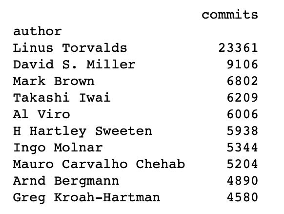
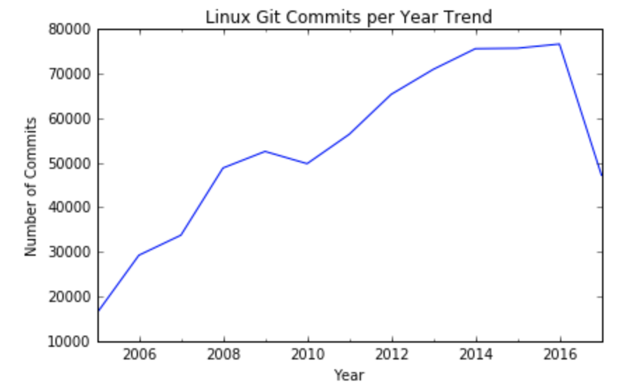

# Evolution of Linux
## Introduction
Version control repositories contain every change to the source code including the date (the “when”), the responsible developer (the “who”), as well as little message that describes the intention (the “what”) of a change.
n this notebook, we will analyze the evolution of a very famous open-source project – the Linux kernel. 
Linus Torvalds, the (spoiler alert!) main contributor to the Linux kernel (and also the creator of Git), created a  [mirror of the Linux repository on GitHub](https://github.com/torvalds/linux/) . It contains the complete history of kernel development for the last 13 years.

(https://commons.wikimedia.org/wiki/File:Tux.svg)

## Objective & Results
We get some first insights into the work of the development efforts by
* Identifying the TOP 10 contributors 

* Visualizing the commits over the years.

## References
* This project is taken from DataCamp [link](https://www.datacamp.com/home)
