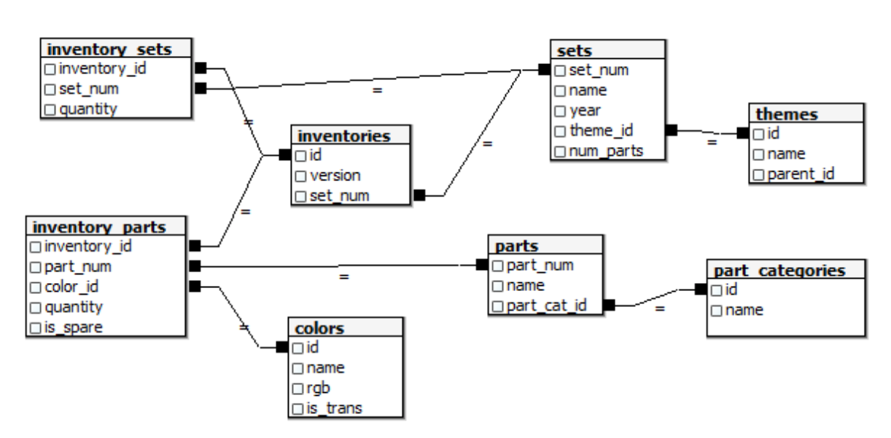

# Exploring 67 years of LEGO
## Introduction
In this project, we will analyze a fascinating dataset on every single lego block that has ever been built!

A comprehensive database of lego blocks is provided by [Rebrickable](https://rebrickable.com/downloads/). 
The schema of the data is shown below.

## Exploration
* Start by understanding the number of colors available
* Look at the distribution of transparent vs. non-transparent colors
* How have the average number of parts in Lego sets has varied over the years?
* Getting a sense of how the number of themes shipped has varied over the years.

## References
* This project is taken from DataCamp [link](https://www.datacamp.com/home)
