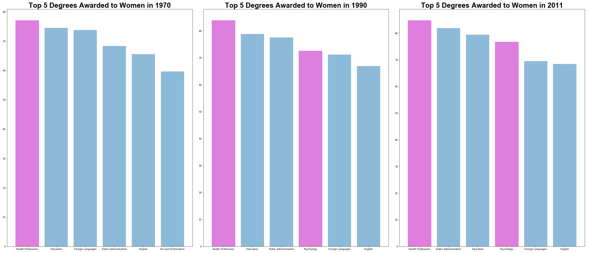
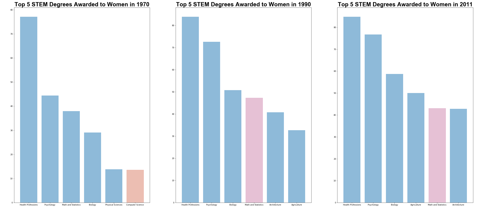
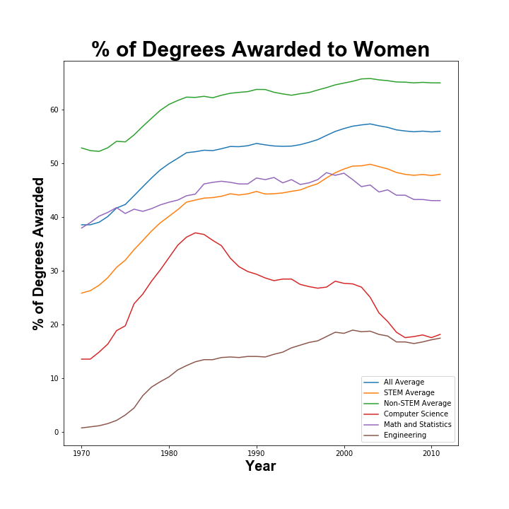
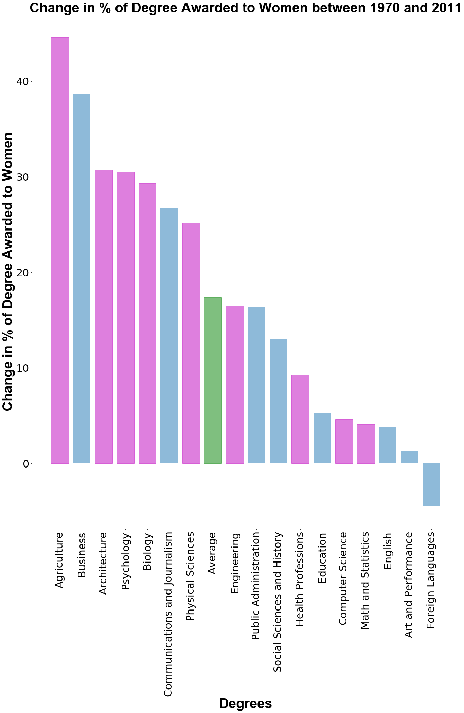

# Women in STEM: A Look at Postsecondary Degrees Awarded

“Women make up half of the total U.S. college-educated workforce, but only 29% of the science and engineering workforce… (compared to men in the field) there are relatively low shares in engineering (15%) and computer and mathematical sciences (25%).”- National Girls Collaborative Project

Why care about female representation in STEM? 
[Bianca Barratt](https://www.forbes.com/sites/biancabarratt/2018/11/17/the-need-for-more-women-in-stem-roles-goes-beyond-simple-diversity/#38bd614445cb) states it beautifully and succintly:
"This push goes beyond the need for simple gender parity. It is not just a case of making the STEM workforce fair – we need more women in STEM roles to make scientific innovations useful and, more importantly, safe . After all, how relevant can innovations really be if they do not even take into consideration the needs of half the population?"

In this notebook, we will focus on exploring the statistics and trends on postsecondary degrees awarded to women between the years 1970 and 2011. 

For the purposes of this EDA, the following majors will be considered STEM: 
* Agriculture
* Architecture
* Biology
* Computer Science
* Engineering
* Health Professions
* Math and Statistics
* Physical Sciences
* Psychology

A full list of STEM degrees recognized by the Department of Homeland Security is available [here](https://www.ice.gov/sites/default/files/documents/Document/2014/stem-list.pdf).

### Objective and Questions to Answer
* Overall, has there been an increase or decrease in women getting postsecondary degrees?
* What were the most popular degrees for women in 1970, 1990 and 2011?
* Comparing STEM versus Non-STEM degrees: Is there a significant divide?
* Among the 17 types of degrees considered: Which ones have become more popular among women? Which ones are less popular than average?

### Key Takeaways:

* Health professions remains the most popular degree among women all through the years. Psychology entering the top 5 around 1990. 

* Health Professions, Psychology and Biology are consistently the top 3 STEM degrees for women.
* While computer science was the 5th most popular degree (13.6%), it is replaced by other STEM degrees (such as Math, Architecture and Agriculture) in subsequenct years.
 
* Women now obtain postsecondary degrees at a higher rate compared to men. The percentage of total degrees awarded to women has grown from 38.6 to 56%.
* Women have had higher representation compared to men in Non-STEM fields since 1970 (52.9%). This statistic has increased to 65% over the years.
* It is also encouraging to see the close to 50% of STEM degrees are now awarded to women.
* However, when isolating Computer Science and Engineering degrees, women are still very underrepresented (about 18% respectively).
* We see a period of increased interest in computer science among women between the years 1970 and 1983 (peaked at 37.1%). However, this interest has been on the decline since.
* Women representation in Engineering has been steadily increasing since 1970 (up from less than 1%!). However, this momentum has slowed down since around 1998.

* We see that female representation has increased by around 40% in Agriculture and Business since 1970
* Architecture, Psycology and Biology see a 30% increase in female representation. 
* Foreign Languages, while still predominantly female, sees a 4.4% drop (73.8% to 69.5%). 
* Computer Science and Math rank as the slowest growing STEM degrees amonng women. (Around 4%)
* Most degrees with female representation growing at a faster rate than the overall average are STEM degrees.
* Computer Science is growing at only a quarter of the average pace, Engineering seems to be growing at the average pace.

### Dataset
The dataset used was compiled from Chapter 3 (tables 325.10 through 325.95) of the 2013 version of the Digest of Education Statistics. The Digest includes a selection of data from many sources, both government and private, and draws especially on the results of surveys and activities carried out by the National Center for Education Statistics (NCES). This dataset contains statistics of the percentage of Bachelor’s degrees awarded to women from 1970 to 2011. The data is recorded every year for 17 different fields.
More data can be found on the [National Center for Education Statistics](https://nces.ed.gov/programs/digest/2013menu_tables.asp) website. 

### Brilliant Women in STEM
Here is a [link](https://www.ted.com/playlists/253/11_ted_talks_by_brilliant_wome) to a collection of TED Talks given by brilliant women in STEM. (My personal favorite is Fei-Fei Li's [talk](https://www.ted.com/talks/fei_fei_li_how_we_re_teaching_computers_to_understand_pictures?referrer=playlist-11_ted_talks_by_brilliant_wome) on computer vision!)